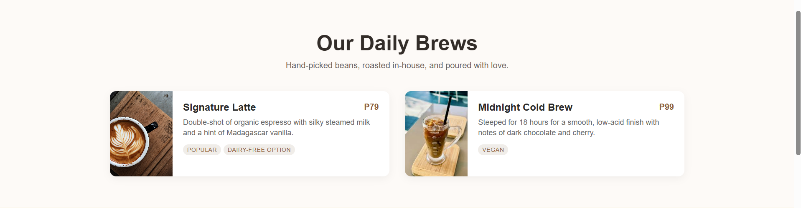
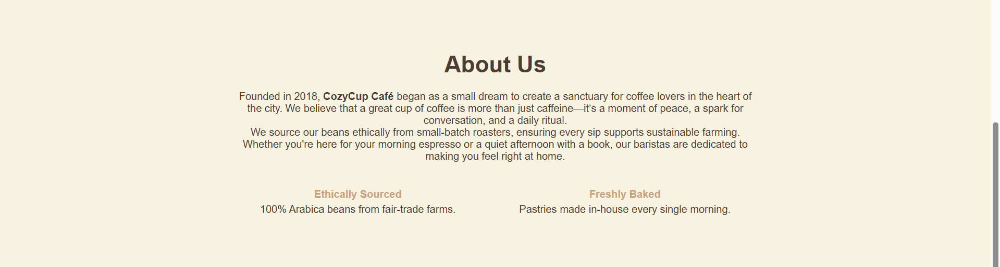

# Project Description

Jako CozyCup Cafe is a warm and inviting coffee shop founded in 2018 with the goal of creating a relaxing space for coffee lovers. The cafe serves carefully selected, ethically sourced coffee beans and freshly prepared drinks made with care by skilled baristas.   Our cafe is a perfect place for morning coffee, casual conversations, or a quiet break, offering quality brews in a comfortable and welcoming atmosphere.

---

## Features
### Drinks
- Signature Latte 79 php
- Midnight Cold Brew 99 php

### Mode of Purchase
- Order Online
- Order on the Store (With Free Wifi)

---

# Screen Captures
This is our Home page.

This is our Menu page,
You can see that we have 2 options today,
The Signature Latte and Midnight Cold Brew

This is About us, this where you'll learn facts about our cafe.

This is our socials, if you want to contact us, this is our social media accounts and contact details.

---
# Authors    

**Jazchiel Angelou Gomez**  
**202380079@psu.palawan.edu.ph**

**Miko Patindol**  
**202380039@psu.palawan.edu.ph**

   
**Jazchiel Angelou Gomez - Facebook Account**

   
**Miko Patindol - Facebook Account**
